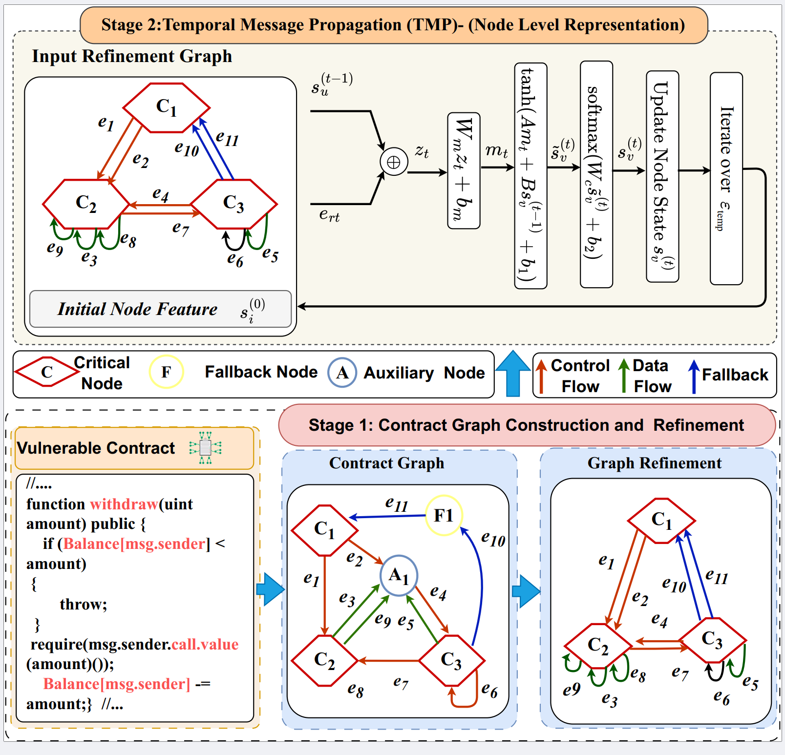
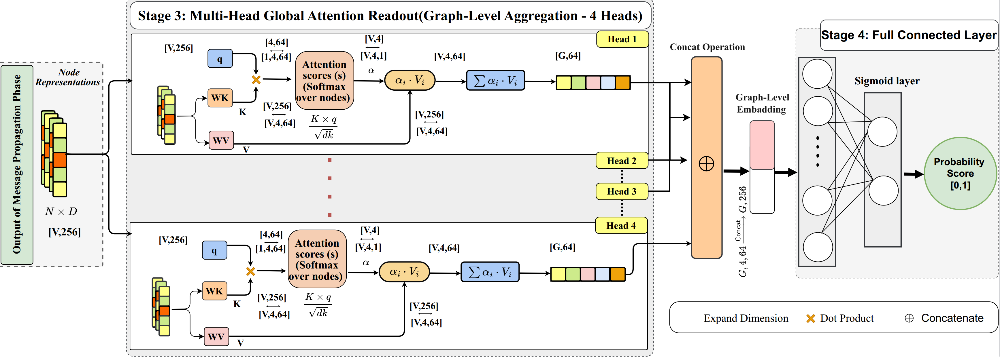

# T-MGA: Temporal Message Propagation with Multi-Head Global Attention for Smart Contract Vulnerability Detection

This repository provides the implementation of **T-MGA**, a temporal graph neural network framework for detecting
smart contract vulnerabilities (e.g., **reentrancy** and **timestamp dependency**) by combining:
- **Temporal Message Propagation (TMP)** to model execution-aware dependencies, and
- **Multi-Head Global Attention (MGA)** readout to emphasize security-critical nodes and execution paths.


## Overview

T-MGA represents a smart contract function as a **temporal execution graph** and learns a graph-level embedding for
binary vulnerability prediction (sigmoid classifier). Unlike uniform pooling, the MGA readout assigns higher weights
to security-sensitive nodes (e.g., `call.value`, `block.timestamp`), producing more discriminative representations.

<p align="center">
  
</p>

---
<p align="center">
  
</p>

---

## Highlights

- **Execution-aware modeling:** TMP updates node states following the temporal order of program interactions.
- **Attention-based readout:** Multi-head global query attention prioritizes security-critical nodes instead of treating all nodes equally.
- **Reproducible pipeline:** Training, validation, metric reporting (Accuracy/Precision/Recall/F1/AUC), and curve plotting are supported.
- **JSON-based datasets:** Training/validation data are stored and loaded from JSON files.

---

## Repository Structure

A typical layout is:

```markdown
TMGA/
├─ train_data/		#dataset for training and validation
│  ├─ reentrancy/
│  │  ├─ train.json		
│  │  └─ valid.json
│  └─ timestamp/
│     ├─ train.json
│     └─ valid.json
├─ data/                     
├─ features/
│  ├─ reentrancy/
│  └─ timestamp/
├─ result/
│  ├─ reentrancy_hist.json
│  ├─ timestamp_hist.json
│  ├─ reentrancy_metrics.json
│  ├─ timestamp_metrics.json
│  ├─ acc_curve.png / .pdf
│  ├─ loss_curve.png / .pdf
│  ├─ metrics_comparison.png / .pdf
│  └─ final_acc_bar.png / .pdf
├─ BasicModel.py              # training loop, metrics, plotting utilities
├─ TMGAModel.py               # TMP + Multi-Head Global Attention readout
├─ utils.py
└─ README.md


#### Dataset structure in this project
All of the smart contract source code, graph data, and training data in these folders in the following structure respectively.

TMGA/
├── data/
│   ├── reentrancy/
│   │   ├── source_code/        # Smart contract source code (Solidity files)
│   │   └── graph_data/         # Extracted contract graphs
│   │       ├── edge/           # Edge lists 
│   │       └── node/           # Node lists 
│   │
│   └── timestamp/
│       ├── source_code/        # Smart contract source code
│       └── graph_data/         # Extracted contract graphs
│           ├── edge/           # Edge lists
│           └── node/           # Node lists
│
│
├── train_data/
│   ├── reentrancy/
│   │   ├── train.json         # Training samples for reentrancy
│   │   └── valid.json         # Validation samples for reentrancy
│   │
│   └── timestamp/
│       ├── train.json         # Training samples for timestamp dependency
│       └── valid.json         # Validation samples for timestamp dependency

      

## Reentrancy

- `data/reentrancy/source_code`: This folder contains the source code of smart contracts.
- `data/reentrancy/graph_data`: This folder contains the graph structure of smart contracts (nodes and edges) extracted by our tool.
- `data/reentrancy/graph_data/edge`: It includes all edges of each reentrancy contract graph.
- `data/reentrancy/graph_data/node`: It includes all nodes of each reentrancy contract graph.
- `features/reentrancy`: It includes all reentrancy features of each smart contract extracted by our model.
- `train_data/reentrancy/train.json`: This file contains the training data for reentrancy detection.
- `train_data/reentrancy/valid.json`: This file contains the testing/validation data for reentrancy detection.

## Timestamp Dependency

- `data/timestamp/source_code`: This folder contains the source code of smart contracts.
- `data/timestamp/graph_data`: This folder contains the graph structure of smart contracts (nodes and edges) extracted by our tool.
- `data/timestamp/graph_data/edge`: It includes all edges of each timestamp contract graph.
- `data/timestamp/graph_data/node`: It includes all nodes of each timestamp contract graph.
- `features/timestamp`: It includes all timestamp dependency features of each smart contract extracted by our model.
- `train_data/timestamp/train.json`: This file contains the training data for timestamp dependency detection.
- `train_data/timestamp/valid.json`: This file contains the testing/validation data for timestamp dependency detection.


## Requirements

#### Required Packages
* **python** 3+
* **TensorFlow** 1.14.0 (tf2.0 is not supported)
* **keras** 2.2.4 with TensorFlow backend
* **sklearn** 0.20.2
* **docopt** as a command-line interface parser 

Run the following script to install the required packages.
```shell
pip install --upgrade pip
pip install tensorflow==1.14.0
pip install keras==2.2.4
pip install scikit-learn==0.20.2
pip install docopt
```

### Dataset
For each dataset, we randomly pick 80% contracts as the training set while the remainings are utilized for the testing set. 
In the comparison, metrics accuracy, recall, precision, and F1 score are all involved. In consideration of the distinct features of different platforms, 
experiments for reentrancy and timestamp dependence vulnerability are conducted on ESC (Ethereum smart contract) dataset.

For original dataset, please turn to the dataset [repo](https://github.com/Messi-Q/Smart-Contract-Dataset).

### Code Files
The tools for extracting graph features (vectors) are as follows:
```shell
${TMGA}
├── tools
│   ├── remove_comment.py
│   ├── construct_fragment.py
│   ├── reentrancy/AutoExtractGraph.py
│   └── reentrancy/graph2vec.py
```

`AutoExtractGraph.py`
* All functions in the smart contract code are automatically split and stored.
* Find the relationships between functions.
* Extract all smart contracts source code into the corresponding contract graph consisting of nodes and edges.
```shell
python AutoExtractGraph.py
```

`graph2vec.py`
* Feature ablation.
* Convert contract graph into vectors.
```shell
python graph2vec.py
```

## Model Training and Evaluation

### Parameter Settings

| Parameter | Default | Description |
|---|---:|---|
| `--optimizer` | Adam | Optimizer used for training |
| `--lr` | 0.002 | Learning rate (η) |
| `--epochs` | 250 | Number of training epochs |
| `--weight_decay` | 2e-4 | L2 regularization strength (λ) |
| `--dropout_fc` | 0.2 | Dropout rate for fully-connected layers (d) |
| `--train_split` | 0.8 | Training split ratio |
| `--val_split` | 0.2 | Validation split ratio |
| `--data_format` | JSON | Dataset format used for training/validation |
| `--attention_heads` | 4 | Number of MGA attention heads |
| `--attn_hidden_dim` | 128 | Hidden dimension for attention module (h) |

Experiments were conducted using an NVIDIA RTX A6000 GPU. The model was trained for 250 epochs using Adam (lr=0.002) with L2 weight decay (2e-4) and dropout (0.2) on fully connected layers. 
Data were stored in JSON and split 80/20 for training/validation.


## Run Command
Train and evaluate the model:

```bash
python TMGAModel.py --random_seed 9930 --thresholds 0.45


